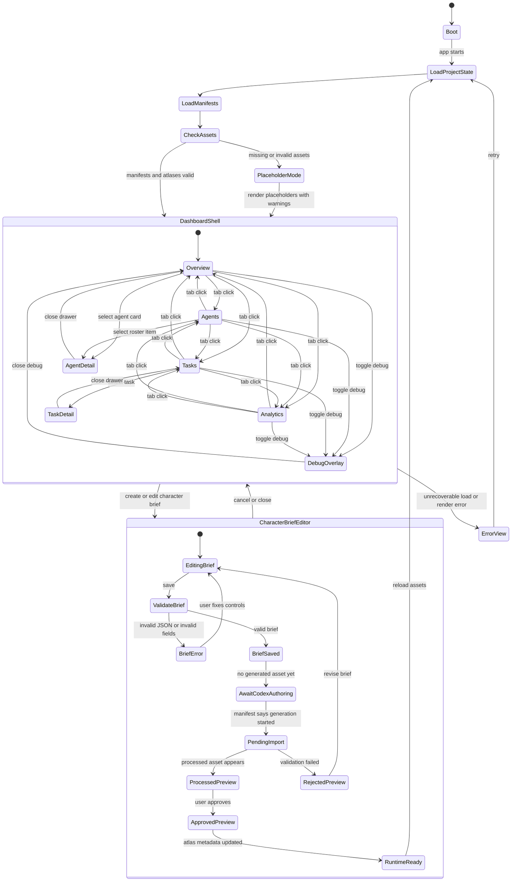
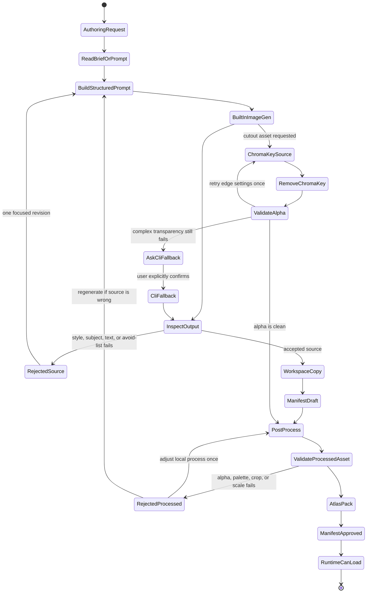

# UI State Graph for the GPT Images 2 + Rust `pixels` Dashboard

## Purpose

This graph explains the user-facing states, the asset authoring states, and the
repository hand-off points for the pixel-art agent dashboard.

The key boundary is simple: the Rust app never calls Codex built-in
`image_gen` at runtime. The app edits and saves structured briefs, then Codex
uses those briefs during an authoring session to generate or edit images. The
runtime consumes only repository files: manifests, processed assets, atlases,
palette data, and deterministic UI code.

## Mental model

```text
User intent
  -> runtime UI state
  -> optional character brief JSON
  -> Codex authoring session
  -> built-in GPT Images 2 source image
  -> workspace copy
  -> manifest and validation
  -> local post-processing
  -> atlas and metadata
  -> Rust `pixels` runtime preview
```

Think of the image model as the café's muralist, not the cash register. It
paints assets during authoring. The running app serves deterministic pixels.

## Primary state graph



## Asset authoring graph



## UI surface states

| State | Owner | What the user sees | Data source |
| --- | --- | --- | --- |
| `Boot` | Runtime | Splash or blank frame | App config |
| `LoadProjectState` | Runtime | Loading indicator | Docs, manifests, palettes |
| `PlaceholderMode` | Runtime | Dashboard with warning badges | Missing or invalid assets |
| `DashboardShell` | Runtime | Main coffee-shop dashboard | Atlases and deterministic UI |
| `Overview` | Runtime | Scene, queue, activity, stats | App view model |
| `Agents` | Runtime | Agent roster and state cards | Agent model and assets |
| `Tasks` | Runtime | Queue, filters, task details | Task model |
| `Analytics` | Runtime | Charts and system metrics | Deterministic widgets |
| `AgentDetail` | Runtime | Agent drawer or modal | Agent model, portrait asset |
| `TaskDetail` | Runtime | Task drawer or modal | Task model |
| `DebugOverlay` | Runtime | Bounds, IDs, draw order | Renderer debug model |
| `CharacterBriefEditor` | Runtime | Structured controls | JSON brief |
| `AwaitCodexAuthoring` | Runtime | Waiting state with instructions | Saved brief, no asset yet |
| `PendingImport` | Runtime | Import pending badge | Manifest draft or marker |
| `ProcessedPreview` | Runtime | Preview image or sprite | Processed file and metadata |
| `RejectedPreview` | Runtime | Failure reason and revise action | Validation notes |
| `ApprovedPreview` | Runtime | Ready-to-use character | Approved manifest and atlas |
| `ErrorView` | Runtime | Recoverable error panel | Typed error enum |

## Event contract

| Event | From | To | Notes |
| --- | --- | --- | --- |
| `AppStarted` | `Boot` | `LoadProjectState` | Starts asset and config load. |
| `ManifestLoadFailed` | `LoadManifests` | `PlaceholderMode` | Keep the app usable. |
| `TabSelected(tab)` | Dashboard tabs | Dashboard tabs | Preserve shell and scene. |
| `AgentSelected(id)` | `Overview` or `Agents` | `AgentDetail` | Use roster model and portrait. |
| `TaskSelected(id)` | `Tasks` | `TaskDetail` | No image-generation side effect. |
| `DebugToggled` | Any main tab | `DebugOverlay` | Overlay, not a navigation tab. |
| `BriefSaved` | `EditingBrief` | `AwaitCodexAuthoring` | Writes strict JSON only. |
| `CodexGenerationStarted` | `AwaitCodexAuthoring` | `PendingImport` | Recorded in manifest or marker. |
| `ProcessedAssetDetected` | `PendingImport` | `ProcessedPreview` | Runtime can show preview. |
| `PreviewApproved` | `ProcessedPreview` | `ApprovedPreview` | Manifest becomes runtime-ready. |
| `AssetRejected` | `PendingImport` | `RejectedPreview` | Keep validation notes visible. |
| `AssetsReloaded` | `RuntimeReady` | `DashboardShell` | Reload manifests and atlases. |

## Repository hand-off points

```text
src/day2/character_brief.rs
  owns validated brief structures and UI state transitions

prompts/generated/characters/*.md
  stores the final structured GPT Images 2 prompt generated from a brief

assets/source/gpt-images-2/**
  stores accepted source images copied out of Codex's generated-image area

assets/manifests/**/*.json
  records prompt provenance, validation, processing, and runtime use

assets/processed/**
  stores cropped, keyed, quantized, sliced, or otherwise prepared files

assets/atlases/**
  stores packed sprite sheets and JSON metadata consumed by Rust

src/assets/** and src/render/**
  load manifests, atlases, sprites, nine-slice panels, and widget primitives

src/scene.rs and src/layout.rs
  compose the dashboard at the fixed 512x288 virtual resolution
```

## Implementation sketch

```rust
/// High-level application state. Keep image generation outside this enum: the
/// runtime only reads files that already exist in the repository.
pub enum AppState {
    Boot,
    LoadingProject,
    Dashboard(DashboardState),
    CharacterBrief(CharacterBriefState),
    Error(ErrorView),
}

pub enum DashboardTab {
    Overview,
    Agents,
    Tasks,
    Analytics,
}

pub struct DashboardState {
    pub active_tab: DashboardTab,
    pub selected_agent_id: Option<AgentId>,
    pub selected_task_id: Option<TaskId>,
    pub is_debug_overlay_visible: bool,
    pub asset_health: AssetHealth,
}

pub enum CharacterBriefState {
    Editing(BriefDraft),
    ValidationError(BriefDraft, BriefError),
    Saved(BriefId),
    AwaitingCodexAuthoring(BriefId),
    PendingImport(BriefId),
    ProcessedPreview(BriefId, AssetId),
    RejectedPreview(BriefId, ValidationReport),
    ApprovedPreview(BriefId, AssetId),
}

pub enum AssetHealth {
    Complete,
    PlaceholderMode(Vec<MissingAsset>),
    Invalid(Vec<AssetValidationError>),
}
```

## Design decisions captured by the graph

1. The dashboard always remains runnable. Missing art becomes placeholder mode,
   not a crash.
2. `image_gen` belongs to Codex authoring sessions, not the Rust app runtime.
3. Runtime-critical UI is deterministic: text, panels, tabs, bars, charts, hit
   areas, and recurring icons are drawn by code.
4. Generated images must cross a validation gate before they become runtime
   assets.
5. The manifest is the handshake between art generation, post-processing, and
   runtime loading.
6. The Day 2 editor creates briefs and previews assets. It does not become a
   generic chat client or an image API client.
7. Debug visibility is orthogonal to navigation. It overlays the active tab
   rather than becoming a separate feature area.

## Suggested first implementation slice

1. Implement `AppState`, `DashboardState`, and `CharacterBriefState`.
2. Add tests for tab transitions and brief validation transitions.
3. Load manifests into an `AssetHealth` value at startup.
4. Render placeholder mode when required assets are unavailable.
5. Add the brief editor with JSON persistence but no generation call.
6. Add a filesystem refresh action that notices newly processed assets.
7. Wire approved assets into the preview panel and then into the roster.
